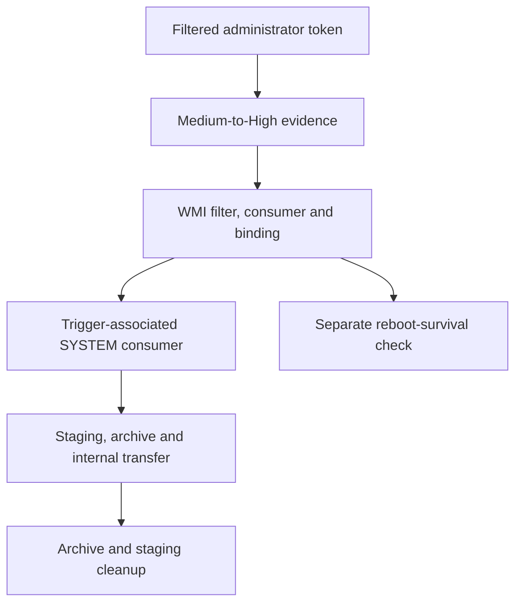

# WMI Persistence Threat Detection

A Windows detection-engineering study of **Fodhelper-related UAC bypass and WMI permanent event subscriptions**, from registration and consumer execution to staging, internal transfer and cleanup. Sysmon telemetry, Elastic EQL rules and run-scoped evidence distinguish each assertion in the chain.

**11 EQL rules · 4 retained runs · Latest: RUN-20261003-04, executed 4 October 2026**

## Start here

| Reading goal | Entry point |
|---|---|
| Understand the research questions and Windows concepts | [Research overview](docs/research/overview.md) |
| Read the study in order | [Technical reading guide](docs/README.md) |
| Inspect the latest evidence | [RUN-04 report](reports/reference-run-20261003-04.md) · [ledger](evidence/runs/RUN-20261003-04/RUN-20261003-04.json) |
| Evaluate the detections | [Rule catalogue](detections/README.md) · [correlation design](docs/detection/correlation.md) |
| Reproduce checks and inspect limitations | [Validation guide](docs/validation/README.md) |

## Study at a glance



This is a **single-endpoint workgroup study**. Scenario stages S1–S7 and rule prefixes such as S1/S4 are separate namespaces. [Stage design](docs/lab/stage-design.md) and [architecture](docs/lab/architecture.md) explain the execution and telemetry roles.

## Latest recorded findings

The main RUN-04 window is **2026-10-04 08:15–08:23 UTC**. The attached reboot check occurs later, with consumer execution at **08:40:21.543 UTC**.

| Finding | Supporting record | Boundary |
|---|---|---|
| Medium → High integrity transition observed | [Before](evidence/runs/RUN-20261003-04/elevation-before.json) / [after](evidence/runs/RUN-20261003-04/elevation-after.json) measurements; corroborating E1 integrity in the report | Filtered token of a local administrator; not standard-user-to-administrator escalation. |
| Subscription registration and SYSTEM consumer execution | E19/20/21 references and process ancestry in the [ledger](evidence/runs/RUN-20261003-04/RUN-20261003-04.json) | Registration, activation and reboot survival are separate assertions. |
| Internal sink received `wdmp.zip`, 16,264 bytes | [Finalised receipt](evidence/runs/RUN-20261003-04/ART-07-01-RUN-20261003-04.json) | First upload failed; three activations are retained. Two connections have missing process-entity attribution. |
| Subscription and consumer survived a reboot | [Reboot evidence](evidence/runs/RUN-20261003-04/reboot-survival.json) | Windows Defender was stopped; AV-on survival remains untested. |
| 51 stored alerts, including 6 for S4 | [Alert manifest](evidence/runs/RUN-20261003-04/alert-manifest.json) | Repeated activations and overlapping schedules; not 51 unique behaviors. |

The run report records **ACCEPTED (ES-BACKED), 49 references across 49 unique Elasticsearch documents**. That is a recorded run result; an offline clone cannot independently repeat the live fetch. Runs 01–03 began at High integrity and do not independently establish the RUN-04 elevation finding.

## Detection and evidence

The export contains **10 building blocks and one ordinary alerting rule, S4**. S4 identifies upload intent; receiver-side receipt evidence supports transfer success. [Query sources](detections/queries/) · [Import bundle](detections/exports/wmi-rules.ndjson) · [Telemetry contract](docs/detection/telemetry-contract.md).

Each [run](evidence/runs/README.md) retains a ledger, prepared artifact copies and receipts. The [historical archive](docs/archive/README.md) contains the April screenshot case study and earlier reviews; their findings belong to their own evidence dates.

## Reproduce the checks

From the repository root:

```bash
python -m unittest discover -s scripts/tests
python tools/validate_repository.py
python scripts/verify/verify_run_evidence.py RUN-20261003-04 --offline
```

The repository has **47 offline component tests**. Offline ledger acceptance is not ES-backed acceptance or a fresh Windows execution. See [validation scope and prerequisites](docs/validation/README.md).

## Repository map

| Location | Contents |
|---|---|
| [docs/](docs/README.md) | Research, lab design, detection, validation and dated historical material |
| [detections/](detections/README.md) | EQL catalogue, sources and NDJSON export |
| [reports/](reports/README.md) · [evidence/](evidence/README.md) | Per-run findings, ledgers, measurements and receipts |
| [payloads/](payloads/README.md) · [config/](config/) | Existing scenario components and Sysmon configuration |
| [scripts/](scripts/README.md) · [tools/](tools/) | Preparation/evidence tooling and offline validators |
| [phishing/](phishing/) | Historical delivery-page artifact; no demonstrated delivery chain |

[Source register](docs/research/references.md) · [Change record](CHANGELOG.md).
