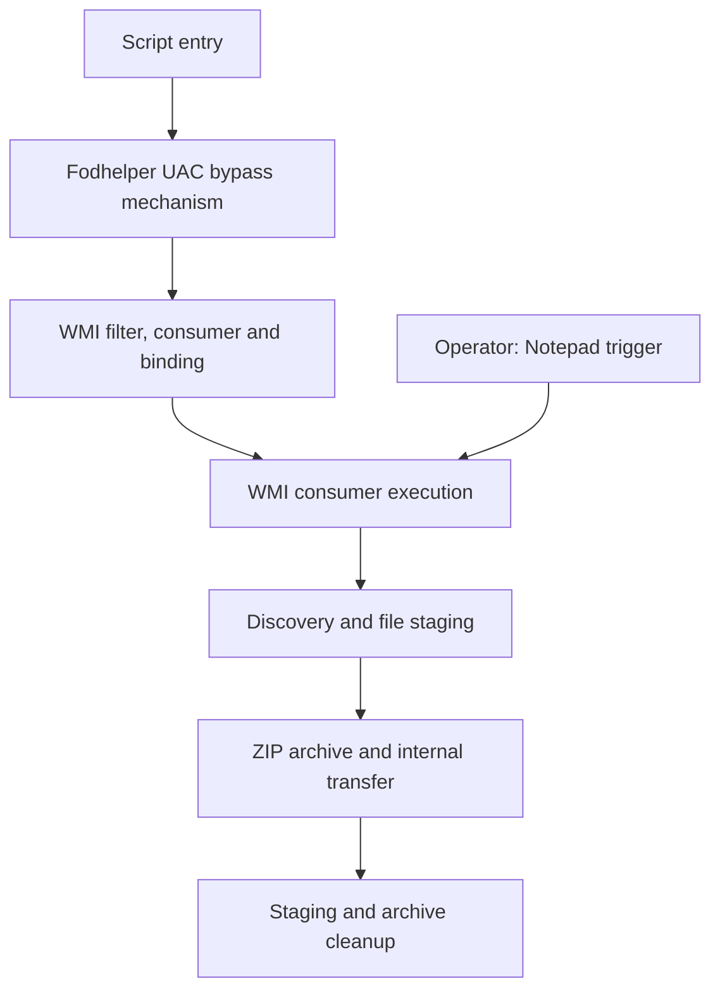

# Windows Kill Chain Design & Detection Engineering

**UAC Bypass · WMI Persistence · Elastic Security**

A Windows security lab that designs a connected local intrusion chain and engineers detections for its observable behavior. The technical focus is **Fodhelper-based UAC bypass** and **WMI permanent event subscriptions**, followed by discovery, collection, archiving, transfer to an internal sink, and cleanup.

The repository brings together the scenario, Sysmon telemetry configuration, **11 EQL detections**, and run-scoped evidence. It follows the chain from registry changes and process ancestry to WMI object registration, consumer execution, file activity, and receiver-side transfer records.

[Reference run (latest)](reports/reference-run-20261003-03.md) · [Historical runs](reports/README.md) · [Detection catalogue](detections/README.md) · [Run ledger (latest)](evidence/runs/RUN-20261003-03/RUN-20261003-03.json) · [Historical review snapshot](docs/repository-review-20261003.md)

## Engineering focus

- **UAC bypass telemetry:** observe the `ms-settings` registry changes, Fodhelper child interpreter, and subsequent PowerShell execution. Assess the process token separately when determining whether privilege elevation occurred.
- **WMI persistence lifecycle:** distinguish filter–consumer–binding registration from trigger-associated execution and persistence across reboot.
- **Behavioral detection:** combine six single-event queries and five EQL sequences, with explicit field dependencies, scheduling, and suppression settings.
- **Evidence-driven investigation:** retain Elasticsearch event references, UTC timestamps, artifact hashes, a transfer receipt, and post-run cleanup observations.

## Scenario design

The scenario uses a standalone Windows workstation in a workgroup. Entry and the Notepad trigger are operator actions; the intervening installation and subsequent consumer activity are scripted.



This diagram describes the scenario. The reference run records how it was actually launched and what the collected evidence supports.

| Stage | Behavior | Primary telemetry | Related rules |
| --- | --- | --- | --- |
| S1 | Script entry | Sysmon 1: entry process | Recorded context |
| S2 | UAC bypass mechanism | Sysmon 13: registry writes; Sysmon 1: Fodhelper → script host → PowerShell | R1, C1, S1, S2 |
| S3 | WMI subscription registration | Sysmon 11: consumer file; Sysmon 19/20/21: filter, consumer, binding | C2 |
| S4 | Trigger-associated consumer execution | Sysmon 1: Notepad and SYSTEM PowerShell under WmiPrvSE (user + parent verified) | R2, S3 |
| S5 | Discovery and staging | Sysmon 1: discovery process (ancestry-joined to the interpreter); Sysmon 11: staging files | C3; C4 |
| S6 | Archive and internal transfer | Sysmon 11 zip create; curl E1 (upload intent) + E3 to the sink; sink receipt | C4 (staging→archive, same entity), S4 (upload intent, lab analogue); the receipt proves the transfer |
| S7 | Staging and archive cleanup | Sysmon 23 (same path as the create); post-run state checks | C5 (create→delete, per-clause `by file.path`) |

Rule IDs such as **S1** identify detections; stage IDs such as **S1** identify scenario steps. They are separate namespaces.

## Recorded results

Four runs are recorded. The **latest is RUN-20261003-04** (4 October 2026,
**08:15:00–08:23:00 UTC**, declared window) — the first run with a **Medium-integrity
start** that demonstrates the UAC bypass's Medium→High transition and includes the
**reboot-survival (AV-off) evidence**. RUN-20261003-01/02/03 are historical.
Environment: Windows 10 Pro 19045, Sysmon 15.21, Elastic Agent 9.5.3, Elasticsearch
9.5.3, internal sink on port 9180.

| Record | Published result (RUN-20261003-03) |
| --- | --- |
| Verifier | `verify_run_evidence.py RUN-20261003-03` → **ACCEPTED (ES-BACKED)**: 22 event refs across 22 unique documents re-fetched; timestamp/code/host/join fields matched |
| UAC-related activity | Registry writes and the Fodhelper → wscript → PowerShell chain; ancestry verified by `parent.entity_id` |
| WMI activity | EID 19/20/21 Created; binding references parsed and equal; consumer runs as **SYSTEM** with parent **WmiPrvSE.exe** |
| Internal transfer | Curl E1→E3 ownership by `process.entity_id` to the sink; sink receipt records `wdmp.zip` 14,661 bytes + sha256 (archive bytes are gitignored — the receipt is the committed evidence) |
| Detection (stored alerts) | **25 stored alerts** across the 11 rules, exported with ids/timestamps to `evidence/runs/RUN-20261003-03/alert-manifest.json` |
| Detection (behaviour) | Direct EQL re-evaluation of the same window: one cluster per rule (R1 and S2 two) — stored alerts are an upper bound due to schedule/lookback re-matching |
| Cleanup | Archive deletion of the same `file.path`; cleanup artifact parsed and run-bound, all checks PASS (subscription left installed by design) |
| Negative control | 2026-10-03 10:00–10:05Z (idle, 5 min): 0 matches for all 11 rules — a short negative check, **not** a false-positive rate |

All three runs pass the strict verifier (ES-backed). Every run started in a
**High-integrity operator session**: the UAC bypass *mechanism* is replayed without
demonstrating a Medium→High token transition, and no reboot-survival test exists. The
historical [review snapshot](docs/repository-review-20261003.md) describes the earlier
state of the repository; its findings are marked superseded there.

## Telemetry and detection workflow

Sysmon writes endpoint events to Windows Event Log. Elastic Agent forwards them to Elasticsearch, where the EQL queries evaluate process, registry, WMI, file, and network behavior. Fleet manages agent enrollment and policy.

Investigation uses same-host process identities where available, WMI object references for registration analysis, and file hashes for artifact comparison. Host-and-time sequences provide context; they do not automatically establish process ancestry or prove that a particular file crossed the network.

- [Query sources](detections/queries/) — readable EQL predicates.
- [Import bundle](detections/exports/wmi-rules.ndjson) — 11 rules with metadata, ATT&CK mappings, schedules, and suppression.
- [Correlation design](docs/correlation-architecture.md) — intended join keys and evidence tiers.
- [Reference report (latest)](reports/reference-run-20261003-03.md) — per-stage observations, stored-alert manifest and limitations; earlier runs are listed in [reports/README.md](reports/README.md).

## Read the project

| Start here | Purpose |
| --- | --- |
| [Reference run (latest)](reports/reference-run-20261003-03.md) | Execution context, timeline, per-stage verification, stored-alert manifest, limitations |
| [Chain design](docs/attack-chain-plan.md) | S1–S7 responsibilities and evidence requirements |
| [Detection catalogue](detections/README.md) | Rule intent and detection basis |
| [Evidence records](evidence/runs/) | Ledger, staged artifacts, manifest, receipt, and cleanup record |
| [Repository review](docs/repository-review-20261003.md) | Current verification results and remaining corrective work |

The April 2026 [case study](docs/case-study.md) and [screenshots](evidence/sanitized-screenshots/) document an earlier version. They are historical material, separate from the October reference run.

## Repository layout

| Directory | Contents |
| --- | --- |
| `payloads/` | Launcher, WMI installer, and consumer scenario components |
| `config/` | Sysmon configuration |
| `detections/` | EQL sources, rule export, and catalogue |
| `docs/` | Architecture, chain design, telemetry analysis, and review |
| `evidence/` | Run records and historical screenshots |
| `reports/` | Execution reports |
| `scripts/` | Evidence helpers, rule generator, sink, verifier, and component tests |
| `tools/` | Repository packaging validator |
| `phishing/` | Historical delivery-page artifact |
| `.github/workflows/` | Offline test and packaging workflow |

## Local checks

From the repository root:

```sh
python scripts/tests/test_offline.py
python tools/validate_repository.py
python scripts/verify/verify_run_evidence.py --all            # ES-backed acceptance
python scripts/verify/verify_run_evidence.py RUN-20261003-03 --offline
```

Current state: **45 component tests pass**; the packaging validator passes and now
scans nested run ledgers, receipts and query/export consistency (drift fails); the run
verifier passes for **all three runs with ES-backed acceptance** (`ACCEPTED
(ES-BACKED)`). Without ES credentials the verifier reports `ACCEPTED-LEDGER-ONLY`,
which is explicitly *not* ES-backed acceptance.

These commands do not execute the Windows scenario. Live event lookup requires the configured Elasticsearch environment; scheduled detection behavior and alert attribution require separate verification in Elastic. Offline tests do not prove EQL compilation, Kibana import/scheduling, detection accuracy or false-positive rates.
