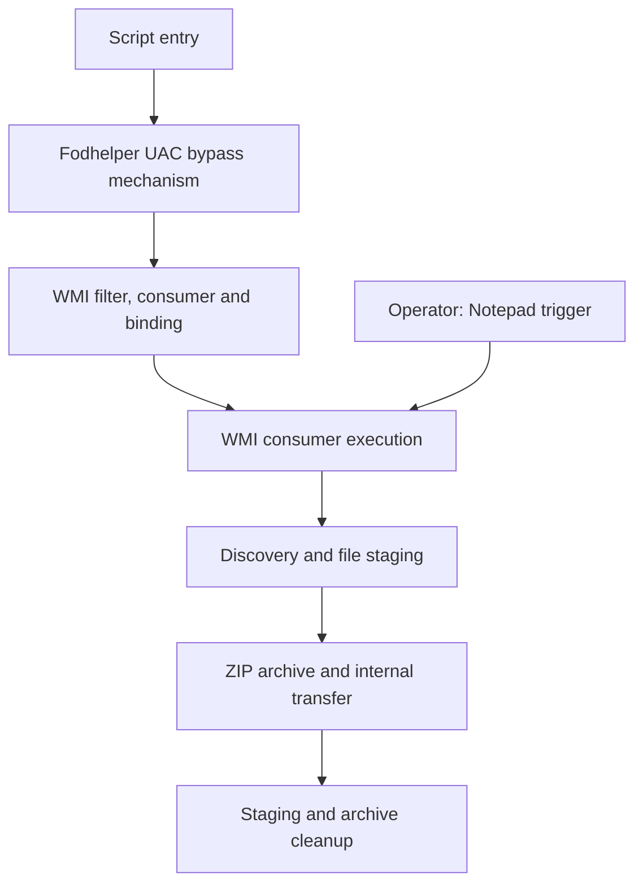

# Windows Kill Chain Design & Detection Engineering

**UAC Bypass · WMI Persistence · Elastic Security**

A Windows security lab that designs a connected local intrusion chain and engineers detections for its observable behavior. The technical focus is **Fodhelper-based UAC bypass** and **WMI permanent event subscriptions**, followed by discovery, collection, archiving, transfer to an internal sink, and cleanup.

The repository brings together the scenario, Sysmon telemetry configuration, **11 EQL detections**, and run-scoped evidence. It follows the chain from registry changes and process ancestry to WMI object registration, consumer execution, file activity, and receiver-side transfer records.

[Reference run](reports/reference-run-20261003-01.md) · [Detection catalogue](detections/README.md) · [Run ledger](evidence/runs/RUN-20261003-01/RUN-20261003-01.json) · [Repository review](docs/repository-review-20261003.md)

## Engineering focus

- **UAC bypass telemetry:** observe the `ms-settings` registry changes, Fodhelper child interpreter, and subsequent PowerShell execution. Assess the process token separately when determining whether privilege elevation occurred.
- **WMI persistence lifecycle:** distinguish filter–consumer–binding registration from trigger-associated execution and persistence across reboot.
- **Behavioral detection:** combine six single-event queries and five EQL sequences, with explicit field dependencies, scheduling, and suppression settings.
- **Evidence-driven investigation:** retain Elasticsearch event references, UTC timestamps, artifact hashes, a transfer receipt, and post-run cleanup observations.

## Scenario design

The scenario uses a standalone Windows workstation in a workgroup. Entry and the Notepad trigger are operator actions; the intervening installation and subsequent consumer activity are scripted.



This diagram describes the scenario. The reference run records how it was actually launched and what the collected evidence supports.

| Stage | Behavior | Primary telemetry | Related rules |
| --- | --- | --- | --- |
| S1 | Script entry | Sysmon 1: entry process | Recorded context |
| S2 | UAC bypass mechanism | Sysmon 13: registry writes; Sysmon 1: Fodhelper → script host → PowerShell | R1, C1, S1, S2 |
| S3 | WMI subscription registration | Sysmon 11: consumer file; Sysmon 19/20/21: filter, consumer, binding | C2 |
| S4 | Trigger-associated consumer execution | Sysmon 1: Notepad and SYSTEM PowerShell under WmiPrvSE | R2, S3 |
| S5 | Discovery and staging | Sysmon 1: discovery process; Sysmon 11: staging files | C3; C4 file stages |
| S6 | Archive and internal transfer | File/process/network activity, manifest and sink receipt | C4/S4 have external-egress predicates; receipt records the internal transfer |
| S7 | Staging and archive cleanup | Sysmon 23 and post-run state checks | C5 requires a preceding qualifying network event |

Rule IDs such as **S1** identify detections; stage IDs such as **S1** identify scenario steps. They are separate namespaces.

## Recorded results

The latest documented execution is **RUN-20261003-01**, on **3 October 2026, 09:54:43–09:56:30 UTC**. Its environment is Windows 10 Pro, Sysmon 15.21, and Elastic 9.5.3.

| Record | Published result |
| --- | --- |
| Run ledger | Seven stage rows with 21 Elasticsearch event references and UTC timestamps |
| UAC-related activity | Registry writes and the Fodhelper → wscript → PowerShell chain are recorded |
| WMI activity | Filter, consumer and binding creation, followed by WmiPrvSE-parented SYSTEM PowerShell |
| Query evaluation | The run report records matches for **8 of 11 rules** through retrospective EQL evaluation |
| Internal transfer | The manifest and receipt record the same archive SHA-256; the receipt records a 14,188-byte ZIP |
| Cleanup | Archive deletion is recorded; the cleanup artifact reports staging removal and the subscription remaining installed |

The run started in a **High-integrity operator session**. It exercises the UAC bypass mechanism without demonstrating a Medium-to-High token transition. The reported query matches are **not stored detection alerts**; C4, S4 and C5 exclude the private-address sink on port 9180.

The report records a local `ACCEPTED` result. In the published checkout reviewed on 3 October, the indexed `wdmp.zip` is absent, so artifact verification returns `FAILED`. See the [review findings](docs/repository-review-20261003.md) for the reproducibility check and the distinction between recorded findings and automated assertions.

## Telemetry and detection workflow

Sysmon writes endpoint events to Windows Event Log. Elastic Agent forwards them to Elasticsearch, where the EQL queries evaluate process, registry, WMI, file, and network behavior. Fleet manages agent enrollment and policy.

Investigation uses same-host process identities where available, WMI object references for registration analysis, and file hashes for artifact comparison. Host-and-time sequences provide context; they do not automatically establish process ancestry or prove that a particular file crossed the network.

- [Query sources](detections/queries/) — readable EQL predicates.
- [Import bundle](detections/exports/wmi-rules.ndjson) — 11 rules with metadata, ATT&CK mappings, schedules, and suppression.
- [Correlation design](docs/correlation-architecture.md) — intended join keys and evidence tiers.
- [Reference report](reports/reference-run-20261003-01.md) — per-stage observations and retrospective query counts.

## Read the project

| Start here | Purpose |
| --- | --- |
| [Reference run](reports/reference-run-20261003-01.md) | Execution context, timeline, results, and recovery state |
| [Chain design](docs/attack-chain-plan.md) | S1–S7 responsibilities and evidence requirements |
| [Detection catalogue](detections/README.md) | Rule intent and detection basis |
| [Evidence records](evidence/runs/) | Ledger, staged artifacts, manifest, receipt, and cleanup record |
| [Repository review](docs/repository-review-20261003.md) | Current verification results and remaining corrective work |

The April 2026 [case study](docs/case-study.md) and [screenshots](evidence/sanitized-screenshots/) document an earlier version. They are historical material, separate from the October reference run.

## Repository layout

| Directory | Contents |
| --- | --- |
| `payloads/` | Launcher, WMI installer, and consumer scenario components |
| `config/` | Sysmon configuration |
| `detections/` | EQL sources, rule export, and catalogue |
| `docs/` | Architecture, chain design, telemetry analysis, and review |
| `evidence/` | Run records and historical screenshots |
| `reports/` | Execution reports |
| `scripts/` | Evidence helpers, rule generator, sink, verifier, and component tests |
| `tools/` | Repository packaging validator |
| `phishing/` | Historical delivery-page artifact |
| `.github/workflows/` | Offline test and packaging workflow |

## Local checks

From the repository root:

```sh
python scripts/tests/test_offline.py
python tools/validate_repository.py
python scripts/verify/verify_run_evidence.py RUN-20261003-01 --offline
```

The reviewed snapshot passes **25 component tests** and the packaging validator. The run verifier fails on the missing indexed archive described above. The packaging validator currently skips nested run ledgers, so its PASS is not evidence of run acceptance.

These commands do not execute the Windows scenario. Live event lookup requires the configured Elasticsearch environment; scheduled detection behavior and alert attribution require separate verification in Elastic.
