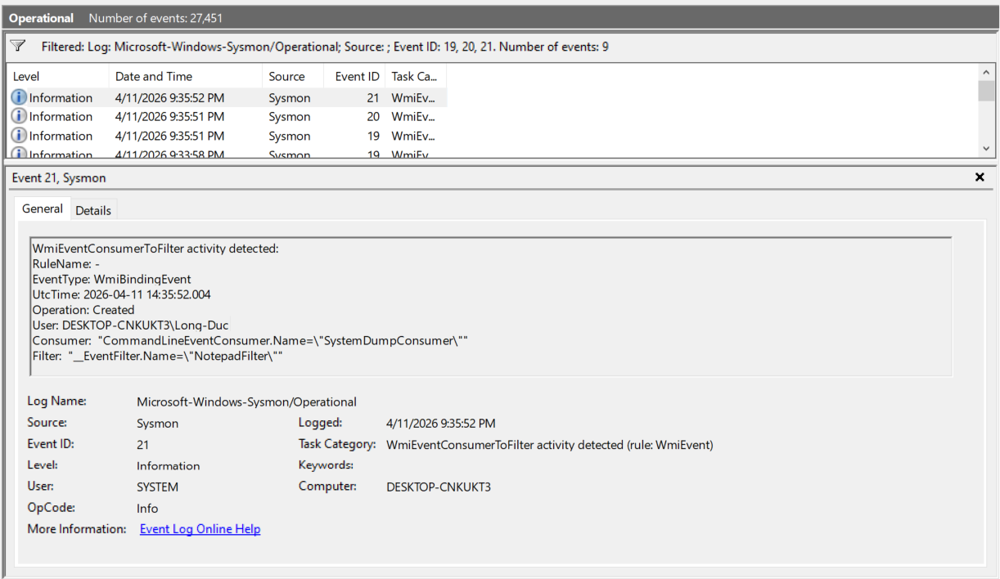
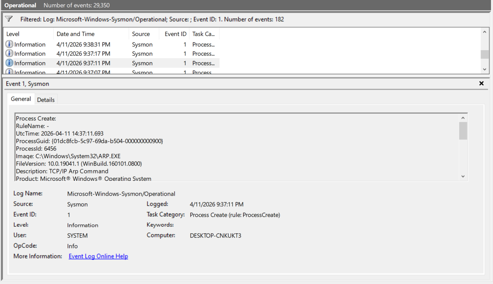
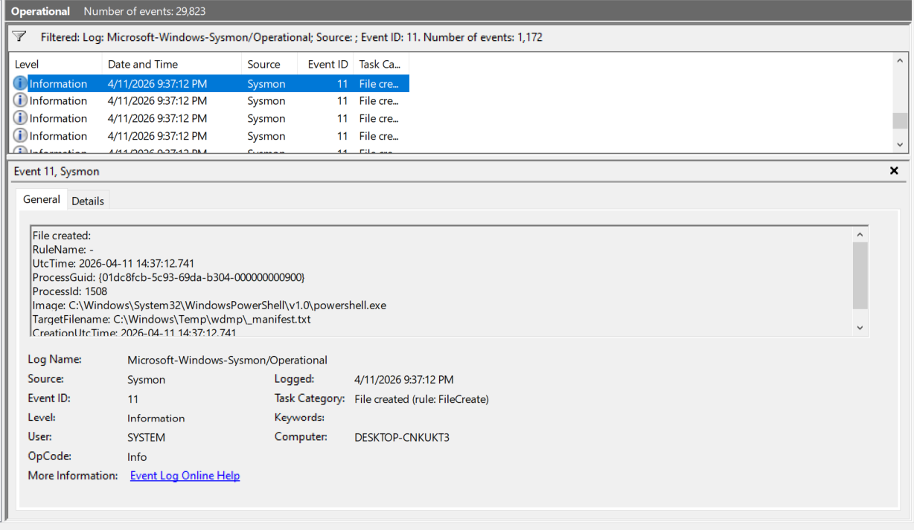
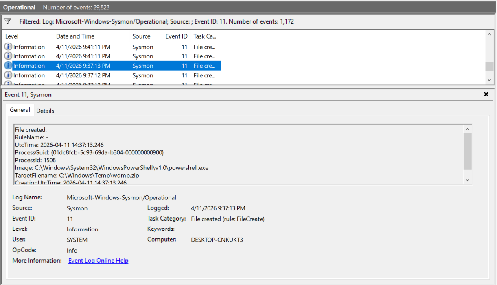
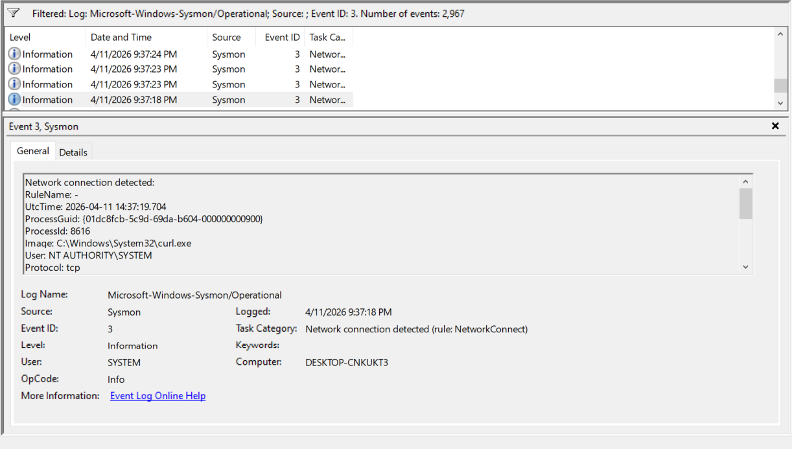
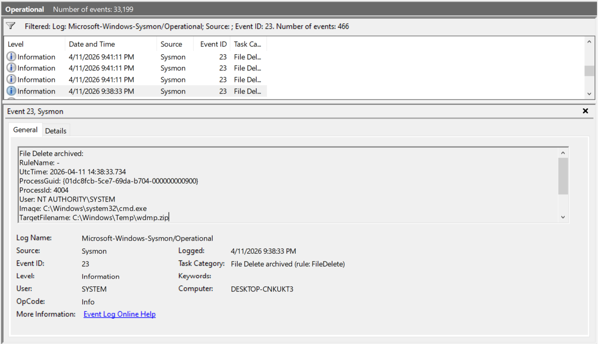
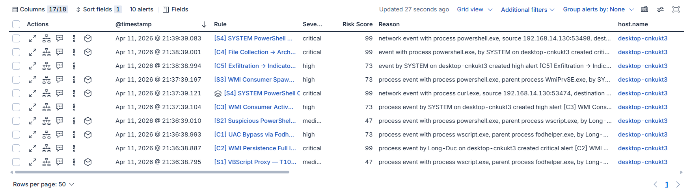

# WMI scenario: evidence and detection assessment

## Research question

Can endpoint telemetry establish the transition from script execution to WMI subscription activity, subsequent data handling, network activity, and cleanup—and do the Elastic alerts support the same interpretation?

## Scope and evidence provenance

This Markdown case study replaces `BaoCao_WMI_Persistent.docx`. It retains the necessary findings and selected original screenshots without preserving unsupported performance claims, generic response prose, or repeated dashboard images.

The evidence originated in repository commit `43a7141c7753058e58bfb0894d4123236ce3d1b9`. The retained images show activity on 11 April 2026. They were extracted unchanged from the Word document; their source names and SHA-256 values are in [the evidence manifest](evidence/manifest.json). The September documentation review is not a new experiment.

The original material describes Windows, Sysmon, Elastic Agent, and Elastic/Kibana. Its environment/configuration descriptions are not fully aligned with the screenshots. A current, verified environment manifest has not been supplied. The Word file is removed from the current tree but remains in Git history.

## What is established

- The code contains the local scenario described in [scenario analysis](scenario-analysis.md).
- The screenshots show WMI subscription events and a selected binding with explicit object references.
- Screenshots show ARP process creation, manifest and ZIP creation, a curl connection, and ZIP deletion.
- An Elastic screenshot contains 10 alerts across C1–C5 and S1–S4, with S4 appearing twice.

These observations support a working telemetry-and-alert demonstration. They do not establish every causal link, transfer outcome, resilience across reboot, or detection accuracy under unrelated activity.

## Selected event timeline

The following times are transcribed from the **UtcTime inside event details**, all on 2026-04-11. The surrounding Windows/Kibana UI uses a different display time. This is a partial timeline, not a complete event export.

| UTC | Selected observation | What can be concluded |
| --- | --- | --- |
| 14:35:52.004 | WMI binding creation | A binding referencing the displayed filter and consumer was created |
| 14:37:11.693 | `ARP.EXE` process creation | That process started; its complete ancestry/output is not visible here |
| 14:37:12.741 | PowerShell creates `_manifest.txt` | Manifest creation, not proof of source-file collection |
| 14:37:13.246 | PowerShell creates `wdmp.zip` | ZIP-path creation; contents are not established |
| 14:37:19.704 | SYSTEM curl network connection | Network activity by curl; transfer success is not established by the event |
| 14:38:33.734 | SYSTEM cmd deletes `wdmp.zip` | Deletion of the displayed archive path |

The manifest and ZIP screenshots share the displayed PowerShell ProcessGuid and PID, which supports their association with one process. Curl and cmd have different process identities; their ancestry and relationship to that PowerShell process need full process events.

## Telemetry coverage assessment

| Claim | Available evidence | Assessment | Missing proof |
| --- | --- | --- | --- |
| Delivery caused execution | Delivery artifact and historical narrative | Incomplete | Download/user action and process-chain evidence |
| Script-host execution occurred | Historical process screenshots and C1/S1/S2 alerts | Supported in part | Complete source-event process tree |
| UAC bypass succeeded | Registry/process evidence in the former report; C1 signal | Privilege transition unverified | Initial account state and before/after integrity/token context |
| Subscription installed | WMI event list and binding details | Supported for the displayed objects | Complete raw 19/20/21 records and matching references |
| Consumer activated | S3 alert reason shows WmiPrvSE-parented PowerShell | Supported at alert level | Underlying process event and subscription-to-execution attribution |
| Persistence survived reboot | Code mechanism | Not tested in published evidence | Controlled restart and subsequent activation evidence |
| Discovery completed | ARP process event and code | Partial | Results of OS/network/account queries |
| Source files were collected | Staging-manifest file event and code | Incomplete | Synthetic source/staged-file manifests and matching hashes |
| Archive created | ZIP file event | Supported for path creation | Archive contents and hash |
| Archive transmitted | curl connection; former report also shows a Telegram attachment | Supporting screenshot evidence, attribution incomplete | Receiver receipt and matching archive hash tied to the run |
| Cleanup occurred | ZIP deletion event | Supported for that ZIP | Per-artifact cleanup outcome; history/subscription outcome separately |
| Rules are accurate | Alert overview | Alerts observed | Positive/negative labels, repeated runs, source-event joins |

## Selected evidence

### E01 — WMI object binding

The selected Event ID 21 references `NotepadFilter` and `SystemDumpConsumer`. The list also contains event types 19 and 20. Their presence in a list does not replace a raw export of their fields.

### E02 — Discovery process

The selected process is `ARP.EXE`. This screenshot does not display the full parent-process section or the command output.

### E03 — Staging manifest

The selected target is `_manifest.txt`. Calling this screenshot proof of all copied user documents would exceed what it shows.

### E04 — Archive creation

The selected file event identifies the ZIP path and the PowerShell process. It does not enumerate archive members.

### E05 — Network activity

The selected Event ID 3 identifies SYSTEM curl. The image does not expose every connection field. The former report's Telegram screenshot adds evidence of an attachment but is not republished here because it includes unrelated account/UI content; receipt/hash verification is still missing.

### E06 — Archive deletion

The selected event identifies cmd and the ZIP path. The former caption claimed deletion of the consumer script as well; that additional claim is not visible in this selected event.

### E07 — Alert overview

The two S4 rows concern different process roles: curl and PowerShell. C4/C5 source events must be examined before assigning their alerts to the archive transfer.

## Detection findings

1. **The query inventory differs from the former narrative.** C1 is a single process event. C3 has no file-staging fallback. S1 observes the script host, not a required PowerShell child.
2. **Same-host sequence matches do not establish causality.** C2–C5 join by host name. Their conclusions need object/process/file relationships.
3. **Network attribution is unresolved.** The archive transmission code uses curl; C4/C5 network stages select PowerShell. A status message could supply a matching event.
4. **The test denominator is missing.** Ten alerts are not a measured true-positive rate. There is no published negative-case baseline or latency dataset.
5. **Configuration provenance matters.** The checked-in XML comment was malformed; the original screenshot shows a differently named loaded config. The corrected XML still needs Windows/runtime validation.

The distinction between process creation and file creation is ordinary telemetry semantics, not a novel project contribution. It is not used here as a claim of exceptional detection capability.

## Detection mapping

The [attack-to-detection mapping](attack-detection-mapping.md) connects each implemented behavior to the rule conditions, telemetry fields, and retained evidence. It also identifies code behaviors that have no dedicated detection in the export.

A credential was exposed in the historical connector export. Current export sanitization does not revoke it or erase earlier history. The owner must complete revocation and historical review.

## References

- [Microsoft Sysmon event definitions](https://learn.microsoft.com/en-us/sysinternals/downloads/sysmon)
- [Elastic EQL syntax](https://www.elastic.co/docs/reference/query-languages/eql/eql-syntax)
- [Detection catalog](detection-catalog.md)
