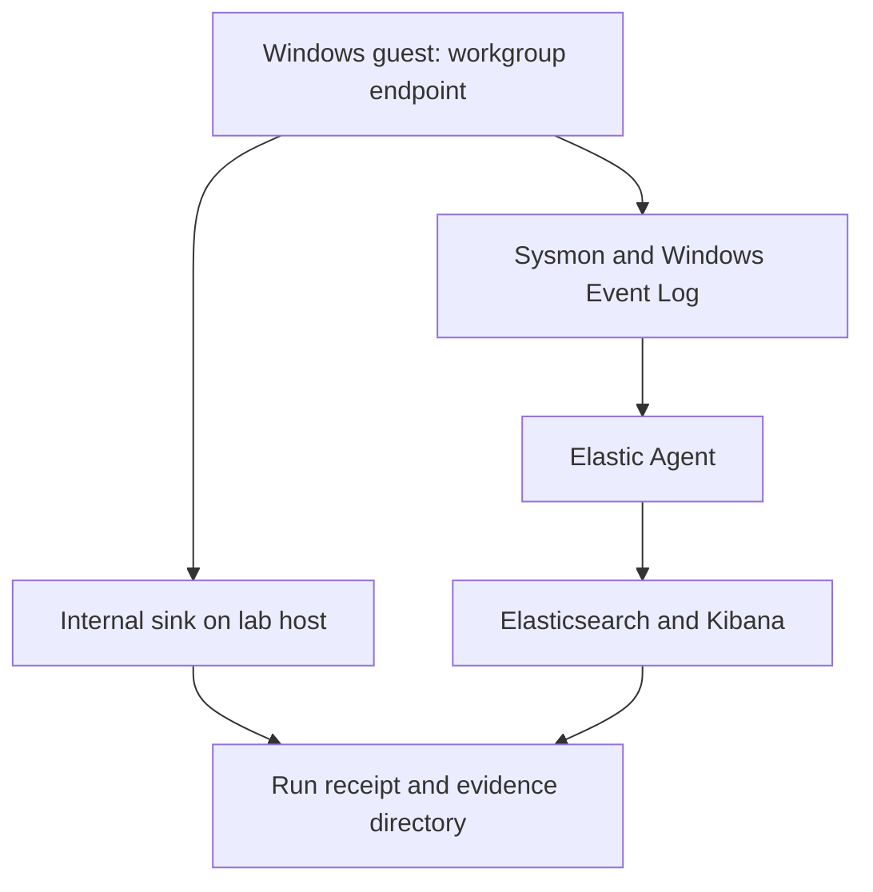

# Architecture — WMI Persistence Lab

## Overview

Single-host personal-workstation scenario: one Windows guest plays the victim; the
repo host runs the internal sink and (optionally) the Elastic stack. No Active
Directory, no domain, no external services. The scenario starts with a local administrator using a filtered token
running a script that abuses UAC (fodhelper) and installs WMI persistence; endpoint
telemetry (Sysmon via Elastic Agent) is evaluated with Elastic Security rules.

This document describes the laboratory design. The [RUN-04 report](../../reports/reference-run-20261003-04.md) records Windows 10 Pro 19045, Sysmon 15.21, Elastic Agent/Elasticsearch 9.5.3 and the internal sink on port 9180. Actual runtime state must be established from each run, not configuration alone.

## Network and hosts

| Host | Role | Identity |
|---|---|---|
| `victim` | Windows 10/11 Pro, workgroup | local user `victim`, member of local Administrators (runs with a filtered token = the fodhelper prerequisite); one separate local admin account for operator-only tasks if needed |
| `lab` | repo host | runs the sink and Elastic integration; ES creds are environment-only (`ES_URL`, `ES_USER`, `ES_PASS`) |

The guest needs no internet access; the exfil destination is the internal sink
(port documented per run), keeping transfer evidence internal and reversible.

## Telemetry path

1. Sysmon (`config/sysmon-config.xml`) writes to
   `Microsoft-Windows-Sysmon/Operational`.
2. Elastic Agent ships Sysmon + Security channels into Elasticsearch.
3. Elastic Security evaluates the rules from `detections/exports/*.ndjson`
   (interval 1 m, look-back 2–3 m per rule; suppression on host/entity groups).

### Sysmon config notes

- Event IDs exercised by the chain: 1, 3, 11, 12, 13, 14, 19, 20, 21, 23.
- `HashAlgorithms = md5,sha256,imphash`; revoke check off.
- `<FileCreate>` includes `\Windows\Temp\`, `\Users\Public\`, `\ProgramData\`,
  `\AppData\Local\Temp\` and script/archive extensions; `<FileDelete>` mirrors those
  paths and the .zip/.ps1/.vbs extensions.
- Network, Registry and WMI are declared as **empty `onmatch="exclude"` sections**
  (log all events of those types: EID 3, 12/13/14, 19/20/21). Omitting the sections
  was observed on Sysmon 15.21 to leave those event types disabled, so they are
  explicit here; the first run still **proves** EID 19/20/21 reach the channel
  (local + ingested) before any C2/R2 claim.
- Image-load (EID 7), process-access (EID 10) and DNS are not
  part of this chain's evidence; if a future chain needs them, add +
  re-verify, never assume.

## Sink (internal transfer target)

`scripts/sink_server.py` listens on the lab host (default port 9180, configurable and
documented per run). Endpoints match the code exactly:

- `PUT /artifacts/<run_id>/<artifact_id>/<filename>` — raw body per artifact;
  `X-WMI-Host` header carries the guest name. The archive is stored under
  `evidence/runs/RUN-<id>/` and the server maintains the receipt JSON
  (`ART-07-01-<run>.json`): observed file name/size/sha256 (raw bytes for the zip)
  and the canonical manifest hash (CRLF→LF normalised) for the ART-06-01 snapshot.
- `POST /status/<run_id>` — receives PowerShell status/notification JSON (this is
  the status channel; the archive transfer is curl, so a status message is never
  read as a transfer — S4 observes the upload-intent E1 signal and the sink receipt
  carries the transfer claim).
- `GET /health` — liveness.
- Receipts never carry credentials; run id and artifact id are validated against the
  expected patterns; filenames are basenames only; upload size is bounded.
- Current upload authentication uses a shared lab token supplied outside committed
  source. Receipt finalisation prevents further accepted uploads for that run.
- The transferred archive bytes are `*.zip`-gitignored: the receipt (name/size/sha256)
  is the committed server-side evidence of the transfer.

## Reproducibility and hygiene

- Deterministic rule ids (`scripts/rules/gen_rules_ndjson.ps1`) so re-imports
  overwrite instead of duplicate; rename ⇒ delete server-side, then import.
- Ledger schema `evidence/runs/RUN-schema.json`; artifacts carry canonical hashes;
  the verifier re-hashes every indexed artifact.
- VM snapshot before each run; cleanup probe + process list after; secrets never in
  ledgers, logs, exports or receipts (env-only).

## References

- `attack-chain-plan.md` — stage design, boundaries, gates.
- `correlation-architecture.md` — joins, tiers, sensor/ingest checklist.
- `config/sysmon-config.xml` — telemetry configuration.
